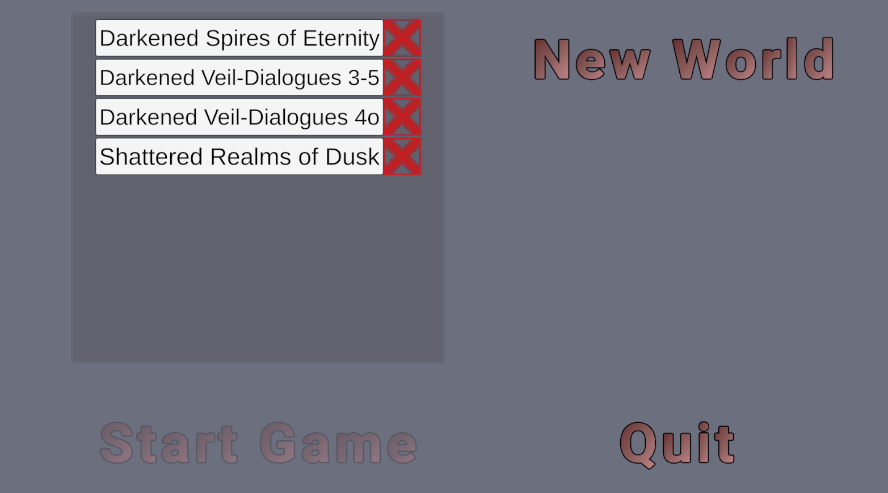
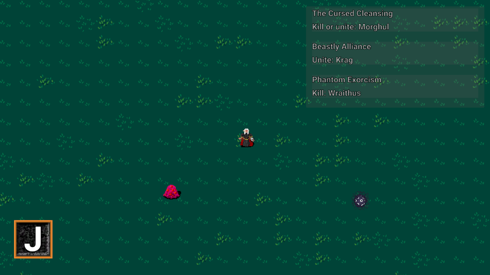
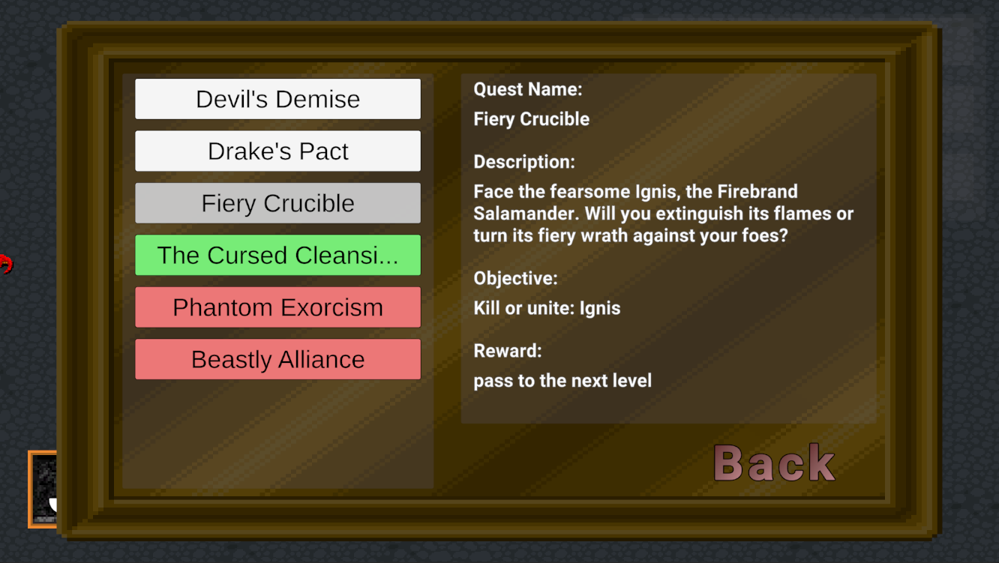
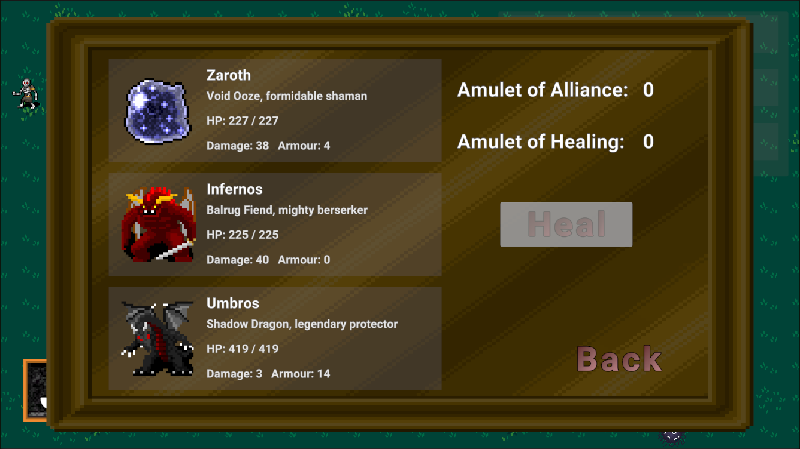
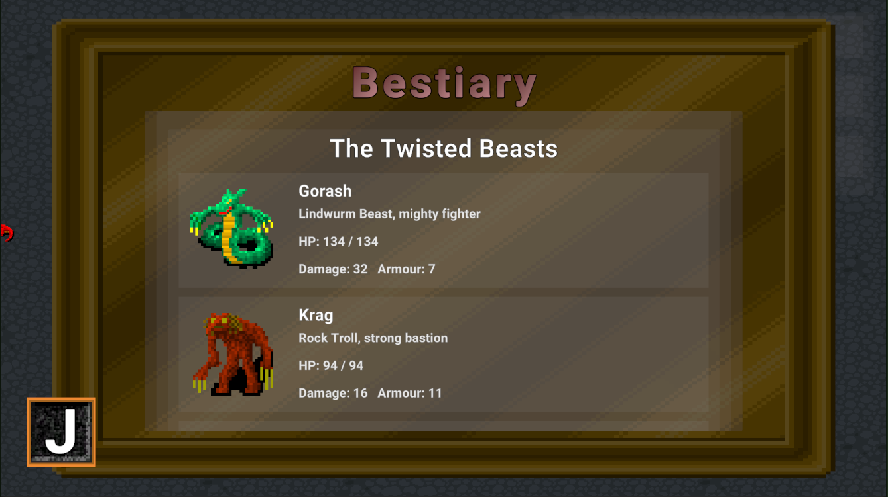
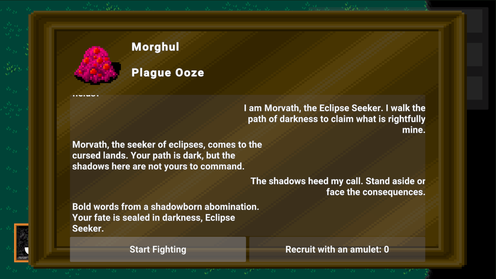
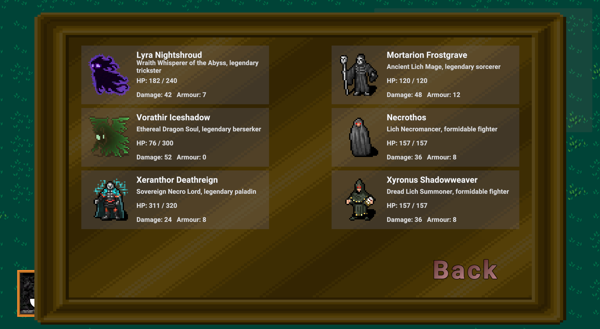
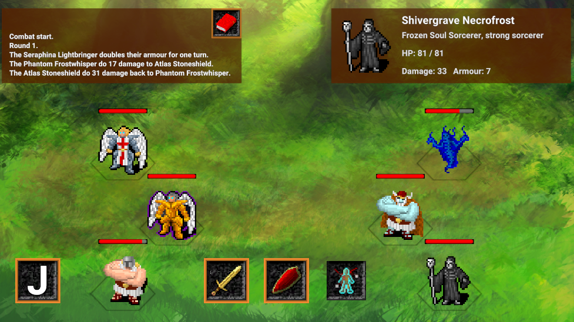

https://github.com/AIChubar/GPTJRPG

# Concept

This project was created for the master diploma thesis "Generating game content with generative language models" for Charles University in Prague. 
This includes the JRPG game made in Unity specifically for this thesis and the application that generates game content for it using the OpenAI API GPT model. 
The generated content, including story, quests, characters, and asset selection, is consolidated into a Game World concept.

# Setting up the project

## GPT JRPG Game

The game only supports the Windows OS and doesn't require any additional software installed. The following steps should be done in order to play the game:

1. Extract the compressed `GPT_JRPG_BUILD.zip` file locally.
2. Launch the `GPT JRPG.exe` executable that can be found in the extracted folder.
3. Choose one of the available Game Worlds and click the button `Start Game`

 

Description of the default Game Worlds can be found here [Default Game Worlds](#default-game-worlds-settings)

## OpenAI API Application

In order to be able to generate a new Game World, you need to have an OpenAI account with enough credits on a balance (at least 1.0$ for the Game World generation with default settings, which is explained in more detail [OpenAI API Settings](#openai-api-settings). Follow these steps to set up the environment to be able to launch the Game World Generator:

1. Have at least Python 3.7.1 or newer installed. You can follow these official guidelines for beginners - [BeginnersGuide/Download | Python Wiki](https://wiki.python.org/moin/BeginnersGuide/Download)
2. Upgrade the PIP to the latest version:
   ```
   pip install --upgrade pip
   ```
3. Install the OpenAI API library by running the following command from the terminal:
   ```
   pip install --upgrade openai
   ```
4. Set up your OpenAI API account - [OpenAI Platform](https://platform.openai.com/auth/login) and add funds to a credit balance.
5. Set up an API key in your OpenAI API account profile - [User settings - OpenAI API](https://platform.openai.com/settings/profile?tab=api-keys).
6. Add a new Windows Environment System Variable, with the Variable name `OPENAI_API_KEY` and set a Variable value to your OpenAI API key.

After that, you will be able to generate a new Game World both from the game Main Menu or by running a python script `run.py` from `...\GPT_JRPG_BUILD\GPT JRPG_Data\StreamingAssets\API` extracted game folder:
```
   python3 run.py
```
## OpenAI API Settings

The folder `...\GPT_JRPG_BUILD\GPT JRPG_Data\StreamingAssets\API` from the extracted game contains the following scripts that make calls to OpenAI after you run the `run.py` script:
1. `api_request_dialogue.py` - Generates dialogues with all enemies groups.
2. `api_request_levels.py` - Generates levels and chooses terrains for them.
3. `api_request_main_character.py` - Generates a protagonist, including name, class, backstory, and protagonist group.
4. `api_request_narrative.py` - Generates story, game messages and the main antagonist.
5. `api_request_quests.py` - Generates quests for each level.
6. `api_request_unit_data.py` - Generates enemy units.

You can find all the prompts in these scripts in the extracted game folder or in the Unity project on GitHub (https://github.com/AIChubar/GPTJRPG/tree/master/Assets/StreamingAssets/API).

You can modify the OpenAI API parameters here, such as the `model` that will be used and the `temperature`, by changing the variables set at the beginning of the script, `model_param` and `temperature_param`.
We recommend using either GPT-4o (`model_param = "gpt-4o"`) or GPT-3.5 turbo (`model_param = "gpt-3.5-turbo-0125"`) models and temperature within the range 0.5 and 1.0.

The current model parameter for all scripts is set to use the model GPT-4o (`model_param = "gpt-4o"`). The Temperature is set to 0.6 for all scripts except the dialogue query, for which the temperature equals 1.0.
The cost of creating one world currently ranges between $0.6$ and $0.8$. The most costly part is the dialogue query, and lowering its model parameter to GPT-3.5 turbo (`model_param = "gpt-3.5-turbo-0125"`) reduces costs to approximately $0.3.

Setting the temperature above the recommended value may cause a broken structure and can make this Game World unlaunchable.

## Default Game Worlds Settings

The Game Worlds available in the game and generated ones can be found in the `...\GPT_JRPG_BUILD\GPT JRPG_Data\StreamingAssets\Worlds` folder. We used two API parameter setups to generate the default Game Worlds:

- The default temperature (described above) and the GPT-4o model for all queries. This setup was used to generate the Shattered Realms of Dusk Game World.
- The default temperature (described above) and the GPT-4o model are used for all queries except the dialogue, which uses the GPT 3.5 turbo model. This setup was used to generate Darkened Spires of Eternity.

The Game World **Darkened Veil** is generated using both setups and can be distinguished in the Menu by the additional subtitle to the Game World name you can see on the screenshot of the menu above.

# Game Documentation

Here, you can find information about the game GPT JRPG, namely controls, game flow, UI, and a description of some systems.

## Controls

The game is controlled using a keyboard and a mouse:
Movements - **WASD**
Pause Menu - **ESC**
Knowledge Base - **J**
Interaction with UI buttons - **Left Mouse Button Click**

## Game Flow

The core gameplay involves progressing through levels, engaging with enemies, completing quests, and managing units to form a strong and balanced team. The main goal is to defeat the world antagonist. The game's difficulty and the necessity of adapting the playstyle come from the fact that units do not heal after battles. Players must carefully select battles that can provide an item that might help recruit new units or heal the group.

To progress through the levels, you need to complete quests with a reward `pass to the next level`, and a final quest is indicated with a reward `win`.



## UI

UI is an important part of the game. It allows the player to receive information about the current Game World and perform certain actions.

### Quest Journal 

Here, players can find all the information about the quests. Each quest has a colour indentation, whether it is completed (green), failed (red) or currently available (white). By clicking on the quest more detailed information can be found. 



### Group Info

The current protagonist group data is displayed in the group info menu. The units’ positions here correspond to those in battle and can be swapped. Information about the available items and units that can be healed with the amulet of healing can also be found here. An amulet of alliance is used to force an enemy to be recruited.



### Knowledge Base

The knowledge base contains data about the current Game World, such as the descriptions of levels, stories, units, and also unit classes available in the game. Here is what the bestiary with all existing units in the game looks like.



### Dialogue Window

Open upon interacting with the enemy. During the dialogue, the player answers to the world enemy phrases by choosing from the available answers. At some point, the dialogue ends, and buttons with the possible actions appear depending on the dialogue outcome.



### Recruit Menu

Open upon interacting with the enemy. During the dialogue, the player answers to the world enemy phrases by choosing from the available answers. At some point, the dialogue ends, and buttons with the possible actions appear depending on the dialogue outcome.



## Battle System

The game features a turn-based battle system. Combat is structured into rounds, with each round concluding once every protagonist unit has performed its action. There are three types of actions available during combat:

- **Attack** - deals damage to a chosen enemy unit.
- **Defend** - doubles the armour.
- **Ability** - uses the unique for each class ability. You can find information about classes in the Knowledge Base inside the game.


